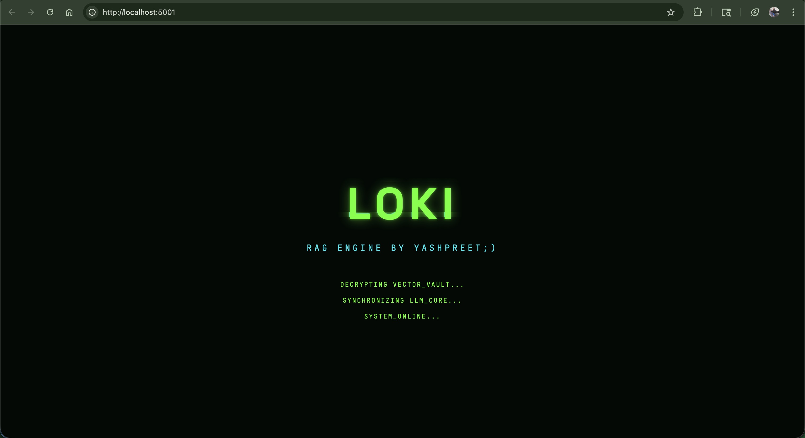
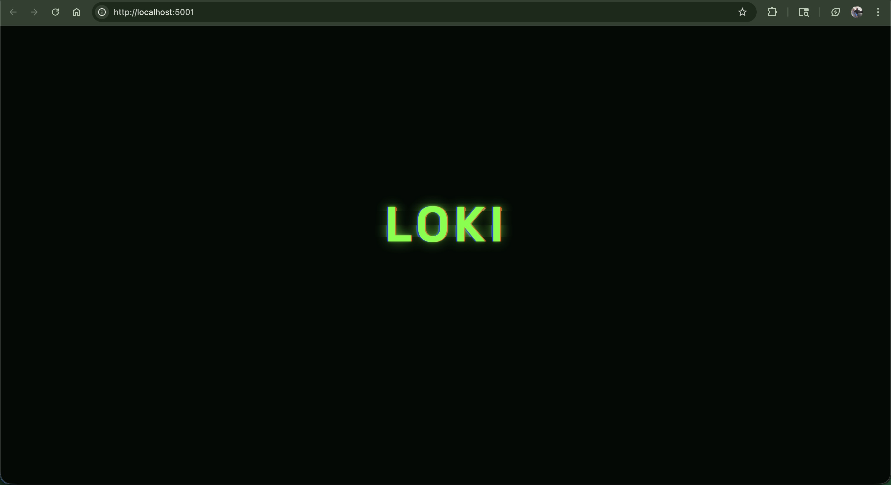
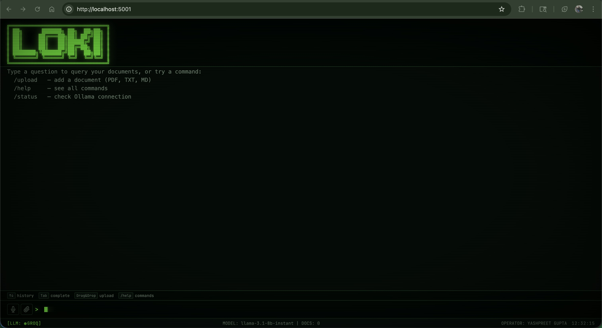
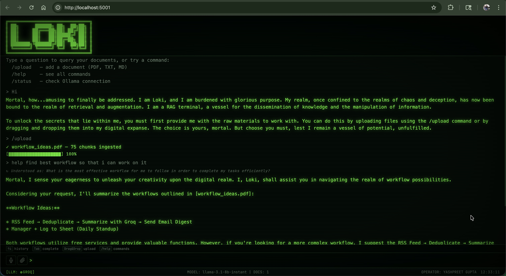

# ⚡ LOKI: RAG Terminal

A high-tech, terminal-themed **Retrieval-Augmented Generation (RAG)** system. Built for speed, privacy, and aesthetic dominance. 

Upload your documents (PDF, TXT, Markdown), and LOKI will parse, chunk, and embed them into a local vector vault, allowing you to query your data in natural language with cited, real-time responses.

---

## 📸 Preview

<div align="center">
  
  
  <br/>
  
  
</div>

---

## 🚀 Quick Start (Local)

LOKI is designed to run locally with **zero API costs**.

### 1. Requirements
*   **Ollama**: [Download here](https://ollama.com/)
*   **Model**: `ollama pull gemma:2b` (or your preferred model)

### 2. Setup
```bash
# Clone the repo
git clone https://github.com/Yashpreetg24/LOKI-RAG
cd LOKI-RAG

# Create virtual environment
python -m venv venv
source venv/bin/activate

# Install dependencies
pip install -r requirements.txt
```

### 3. Launch
```bash
cp .env.example .env
python run.py
```
👉 Access the terminal at **http://localhost:5001**

---

## 🛠️ The Tech Stack

| Layer | Technology |
|---|---|
| **Brain (LLM)** | Ollama (Local) / Groq (Cloud Fallback) |
| **Memory (Vector Store)** | ChromaDB (Local) / Pinecone (Cloud) |
| **Embeddings** | `all-MiniLM-L6-v2` |
| **Backend** | Flask 3 (Python) |
| **Frontend** | Vanilla JS / CSS (CRT Phosphor Theme) |

---

## ⌨️ Terminal Commands

| Command | Action |
|---|---|
| `/upload` | Choose files to ingest |
| `/docs` | List your vector vault contents |
| `/summarize <file>` | Get a quick brief of any doc |
| `/delete <file>` | Wipe a file from the vault |
| `/status` | Check system vitals |
| `/help` | See all available protocols |

---

## 📂 Project Structure

```
LOKI-RAG/
├── app/
│   ├── ingestion/     # Parsing & Embedding logic
│   ├── rag/           # LLM chains & Prompt engineering
│   ├── static/        # CRT Terminal UI (HTML/CSS/JS)
│   └── routes.py      # Flask API Endpoints
├── run.py             # System entry point
├── requirements.txt   # Core dependencies
└── .env               # Environment configuration
```

---

## 👤 Author
**Yashpreet Gupta**
*"Burdened with glorious purpose."*

---
LICENSE: MIT
